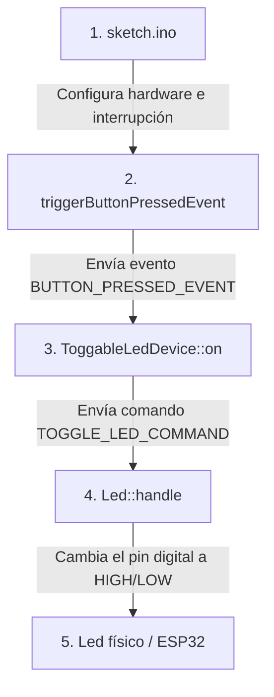

# 🚀 Guía de Arquitectura, Flujo de Lectura y Simulación con Wokwi

¡Bienvenido al mundo de **IoT (Internet de las Cosas)** y de **C++**! Si no tienes experiencia previa en estas áreas, no te preocupes. Este proyecto es excelente para comenzar porque implementa un caso de uso clásico: **conmutar (encender y apagar) un LED mediante un botón físico**, pero utilizando una arquitectura limpia, profesional y moderna de nivel industrial.

Esta guía está diseñada especialmente para ti, explicándote paso a paso la estructura del proyecto, el flujo exacto que sigue el código y cómo simularlo de manera sencilla.

---

## 🧭 ¿Por dónde empezar a leer el proyecto? (Flujo de Lectura)

Para entender cómo funciona el sistema sin perderte en los detalles técnicos, te recomiendo seguir este orden exacto de lectura:



### Paso 1: `sketch.ino` (El Punto de Entrada)
Todo programa compatible con Arduino/ESP32 empieza por el archivo principal, que aquí es `sketch.ino`.
*   **¿Qué leer aquí?** Mira la función `setup()`. Verás que inicializa la consola (`Serial`) y configura una **interrupción física** en el botón.
*   **El bucle `loop()` está vacío**: ¡Esto es genial! En lugar de estar preguntando todo el tiempo si se presionó el botón (sondeo o *polling*), el microcontrolador "duerme" y solo se activa cuando ocurre una interrupción del hardware.

### Paso 2: La Rutina de Interrupción (ISR) y Rebote
Dentro del mismo `sketch.ino`, lee la función `triggerButtonPressedEvent()`.
*   Esta es la **ISR** (Rutina de Servicio de Interrupción). Se ejecuta inmediatamente al presionar el botón.
*   Aquí se aplica un filtro de tiempo llamado **eliminación de rebote (debouncing)** para ignorar falsas pulsaciones de milisegundos producidas por el botón metálico.
*   Si la pulsación es válida, le avisa al dispositivo principal enviando un mensaje: `Button::BUTTON_PRESSED_EVENT`.

### Paso 3: `ToggableLedDevice.h` y `.cpp` (El Cerebro)
Esta clase representa el dispositivo IoT completo y unifica al Botón (Sensor) y al LED (Actuador).
*   **Constructor**: Inicializa el botón y el LED, y les pasa el puntero `this` (el propio dispositivo) para que él sea el encargado de escuchar lo que ocurre en sus componentes.
*   **Método `on(Event event)`**: Cuando el botón detecta la pulsación, llama a esta función del dispositivo. El dispositivo dice: *"¡Ah! El botón se presionó, entonces le daré la orden al LED de conmutar (toggle)"* enviando la instrucción `Led::TOGGLE_LED_COMMAND`.

### Paso 4: `Led.h` y `.cpp` (La Acción Física)
Esta clase controla físicamente el LED conectado al pin GPIO del microcontrolador.
*   **Método `handle(Command command)`**: Recibe el comando de conmutación. Cambia el estado de su variable interna (`state = !state`) y le envía corriente al pin físico (`digitalWrite(pin, state)`).
*   **Confirmación**: Al terminar, informa que completó la acción imprimiendo en la consola serial: `"LED state: 0"` o `"LED state: 1"`.

---

## 💡 Conceptos Clave de C++ y de IoT Explicados Fácilmente

Para que comprendas las palabras técnicas del código, aquí tienes un glosario con analogías simples:

### 1. Interrupciones de Hardware e ISR (`IRAM_ATTR`)
*   **¿Qué es?** Imagina que estás leyendo un libro (el bucle `loop()`) y de repente suena el timbre de tu casa (el botón). No necesitas mirar la puerta cada 2 segundos mientras lees; el timbre interrumpe tu lectura, vas a abrir (eso es la **ISR** o Rutina de Servicio de Interrupción) y luego vuelves a leer donde te quedaste.
*   **`IRAM_ATTR`**: Es una palabra clave para el chip ESP32. Le ordena guardar esa función en la memoria RAM ultra rápida (en lugar de la memoria Flash lenta), para que responda de inmediato en microsegundos ante la pulsación física.

### 2. Rebote por Hardware y Software (Debouncing)
*   **¿Qué es?** Cuando presionas un botón metálico, a nivel microscópico las láminas internas no hacen contacto perfecto a la primera, sino que "botan" o vibran muy rápido durante unos milisegundos, haciendo parecer que presionaste el botón 5 o 10 veces seguidas.
*   **Solución**: El código mide el tiempo transcurrido desde la última pulsación válida. Si han pasado menos de `200 milisegundos` (`DEBOUNCE_DELAY_MS`), ignora esas pequeñas vibraciones.

### 3. Clases base e Interfaces (El diseño orientado a objetos)
Si abres `EventHandler.h` o `CommandHandler.h`, verás código con palabras extrañas como `class EventHandler { virtual void on(Event event) = 0; }`.
*   **Clase Abstracta / Interfaz**: Es un "plano" o "contrato". No puedes crear un "Manejador de Eventos" genérico, pero obliga a cualquier clase que lo implemente (como `ToggableLedDevice`) a tener una función llamada `on()`. Esto asegura que todos los dispositivos del framework hablen el mismo lenguaje estándar.
*   **Herencia (`public Sensor : public EventHandler`)**: Significa que la clase `Sensor` "hereda" o adquiere todas las características de un manejador de eventos.

---

## 🏗️ Arquitectura del Proyecto (CQRS y Event-Driven)

Este framework está inspirado en patrones de nivel profesional muy avanzados:

1.  **Diseño Dirigido por Eventos (Event-Driven Design)**: Los sensores (como el `Button`) son reactivos. No bloquean el procesador; solo notifican cuando ocurre un evento físico (como pulsar el botón).
2.  **Inspirado en CQRS (Segregación de Responsabilidades de Consulta y Comando)**:
    *   **Comandos (Commands)**: Representan una orden para cambiar el estado (ej. "¡Enciende el LED!"). Es una acción de escritura. Los procesa el `Actuator` / `Led`.
    *   **Eventos (Events)**: Representan un hecho del pasado que ya ocurrió (ej. "El botón fue presionado"). Son lecturas. Los generan los `Sensor` / `Button`.

---

## 🛠️ ¿Cómo correr Wokwi en este entorno?

**Wokwi** es el simulador electrónico y de microcontroladores más potente y popular en el mundo de IoT. Tienes dos maneras excelentes de utilizarlo:

### Opción 1: Simulación en Línea (Recomendada y 100% Funcional)
El proyecto incluye un archivo llamado `wokwi-project.txt` que contiene el enlace directo a la simulación ya montada por el autor original.

1. Abre tu navegador web e ingresa a: **[Simulador Wokwi Online](https://wokwi.com/projects/426509456204800001)**.
2. Verás el circuito interactivo con una placa **ESP32**, un botón y un LED rojo conectados en una protoboard.
3. Haz clic en el botón de **Play (Iniciar Simulación)** verde.
4. Presiona el botón azul en la pantalla y verás de inmediato cómo el LED se enciende y apaga, y cómo se imprimen los estados en la terminal serial interactiva a la derecha.

> [!TIP]
> Esta opción es instantánea, no requiere instalar compiladores ni herramientas locales en tu computadora, y es perfecta para ver el código en acción de inmediato.

---

### Opción 2: Correr Wokwi de forma Local en tu Computadora (VS Code)
Si quieres compilar y editar el circuito en esta misma computadora y entorno de desarrollo, **sí es totalmente posible** utilizando la extensión oficial de Wokwi para **Visual Studio Code**.

#### Requisitos para Simulación Local:
Para usar Wokwi en tu computadora, necesitas preparar 3 cosas en tu entorno:

1.  **Instalar la Extensión de Wokwi**:
    *   En VS Code, ve a la barra de extensiones (`Ctrl + Shift + X`).
    *   Busca **Wokwi Simulator** e instálalo.
2.  **Tener el Circuito (`diagram.json`)**:
    *   La simulación local requiere un archivo de configuración de hardware llamado `diagram.json`. Describe qué pines de la placa se unen con el botón y el LED.
    *   *Nota*: Si descargas el proyecto de la web de Wokwi o inicias sesión en la extensión, esta puede descargar e importar tu circuito automáticamente.
3.  **Compilar el Código (Necesario para simular localmente)**:
    *   El simulador local de Wokwi no simula el código fuente C++ directamente; simula el **archivo binario compilado** (con extensión `.elf` o `.bin`).
    *   Por lo tanto, debes compilar este proyecto usando herramientas locales compatibles como:
        *   **PlatformIO** (extensión muy recomendada en VS Code para C++ y Arduino).
        *   **Arduino CLI** o **Arduino IDE** configurado para la placa ESP32.
    *   Una vez que compiles, creas un archivo `wokwi.toml` en la raíz del proyecto para indicarle a Wokwi dónde está guardado el binario compilado. Ejemplo de contenido de `wokwi.toml`:
        ```toml
        [wokwi]
        version = 1
        firmware = 'build/sketch.ino.elf'
        elf = 'build/sketch.ino.elf'
        ```

> [!NOTE]
> La extensión de Wokwi local cuenta con una licencia de uso. Tiene un nivel para creadores y hobbistas que es gratuito, solo requiere iniciar sesión con tu cuenta de Wokwi en el navegador al momento de activarla por primera vez.

---

## 🎯 Resumen y Siguientes Pasos

1.  **Si deseas ver el circuito en acción de inmediato**: Ve a la **Opción 1** (Simulador en línea), dale a *Play* y pulsa el botón. ¡Verás que funciona al 100% sin esfuerzo!
2.  **Si deseas experimentar con el código**: Puedes cambiar los comentarios en español directamente en los archivos modificados de tu workspace y ver cómo el compilador asocia todo.
3.  **Si quieres aprender más C++**: Abre `ToggableLedDevice.cpp` y observa cómo el flujo pasa del botón al LED; es una excelente manera de familiarizarse con el paso de parámetros y punteros (`this`).

¡Disfruta mucho de este viaje en el desarrollo de soluciones IoT con C++! Si tienes cualquier duda sobre alguna línea específica de código, solo consúltame. ¡Estoy aquí para ayudarte! 🚀
